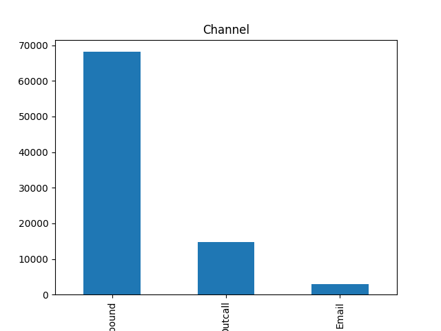
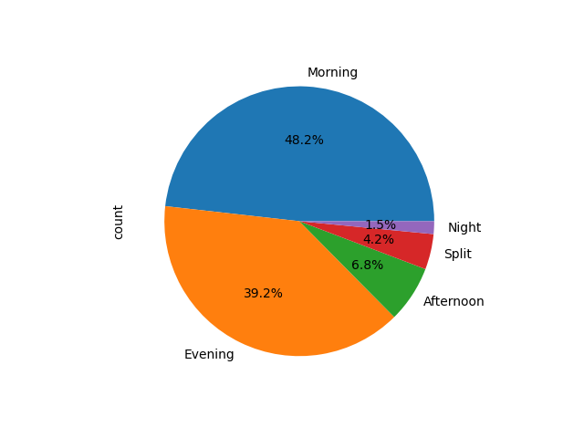
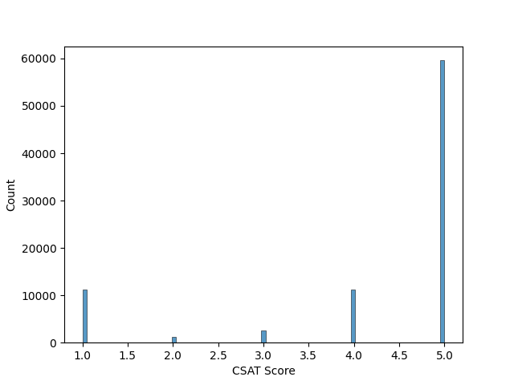
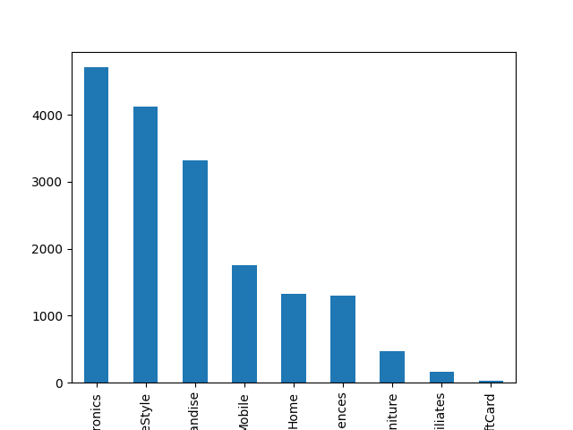
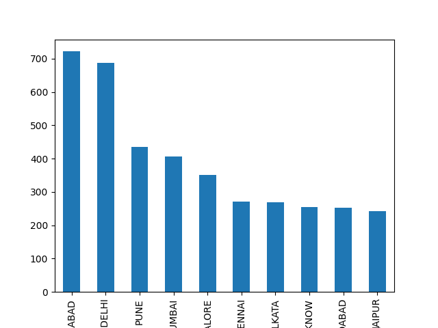
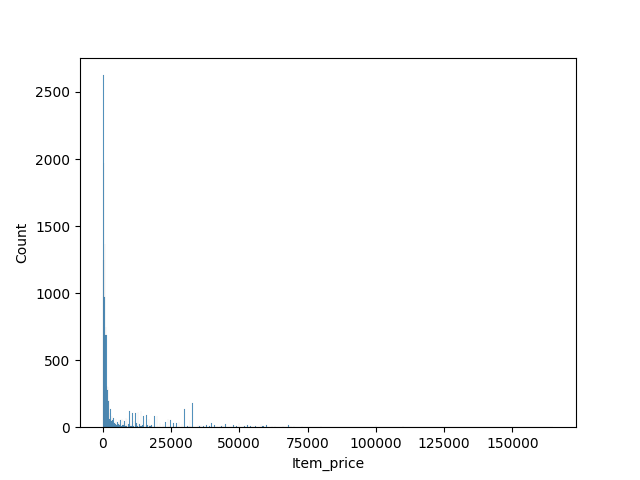

# 📊 Customer Support Performance & CSAT Analysis

## 📌 Overview

This project analyzes customer support data to evaluate service quality, customer satisfaction (CSAT), and operational performance.
It helps identify key trends in customer interactions, agent efficiency, and service bottlenecks.

---

## 🚀 Features

* 📊 Customer Satisfaction (CSAT) Analysis
* 📞 Channel-wise Interaction Insights
* 🕒 Agent Shift Performance Analysis
* 🛍️ Product Category Issue Trends
* 🌍 City-wise Complaint Distribution
* 💰 Item Price Distribution Analysis

---

## 🛠️ Tech Stack

* **Python**
* **Pandas**
* **Matplotlib**
* **Seaborn**

---

## 📂 Project Structure

```
customer-support-analysis/
│
├── data/
│   └── ecommerce.csv
├── analysis.py
├── requirements.txt
├── README.md
└── screenshots/
```

---

## ▶️ How to Run

### 1️⃣ Install Dependencies

```
pip install -r requirements.txt
```

### 2️⃣ Run the Project

```
python analysis.py
```

---

## 📸 Screenshots

### 📊 Channel Distribution



### 🕒 Agent Shift Analysis



### 😊 CSAT Score Distribution



### 🛍️ Product Category Trends



### 🌍 City-wise Complaints



### 💰 Price Distribution



---

## 📈 Key Insights

* Majority of customer interactions occur through specific channels
* Certain agent shifts handle more workload than others
* Customer satisfaction (CSAT) trends vary across interactions
* Some cities generate significantly higher complaint volumes
* Product categories influence customer issues and feedback

---

## 🎯 Business Impact

* Helps improve **customer service efficiency**
* Identifies **high-risk complaint areas**
* Supports **data-driven decision making**
* Enhances **customer satisfaction strategies**

---

## 🔮 Future Improvements

* 📊 Interactive Dashboard (Power BI / Tableau)
* 🤖 CSAT Prediction using Machine Learning
* 🌐 Web Dashboard using Flask/Streamlit
* 📈 Real-time Data Integration

---

## 👩‍💻 Author

**Vrithika Reddy**

---

## ⭐ If you like this project

Give it a ⭐ on GitHub!
